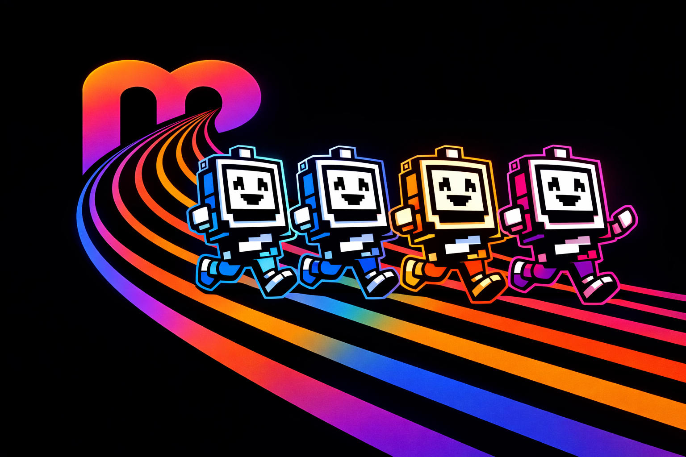
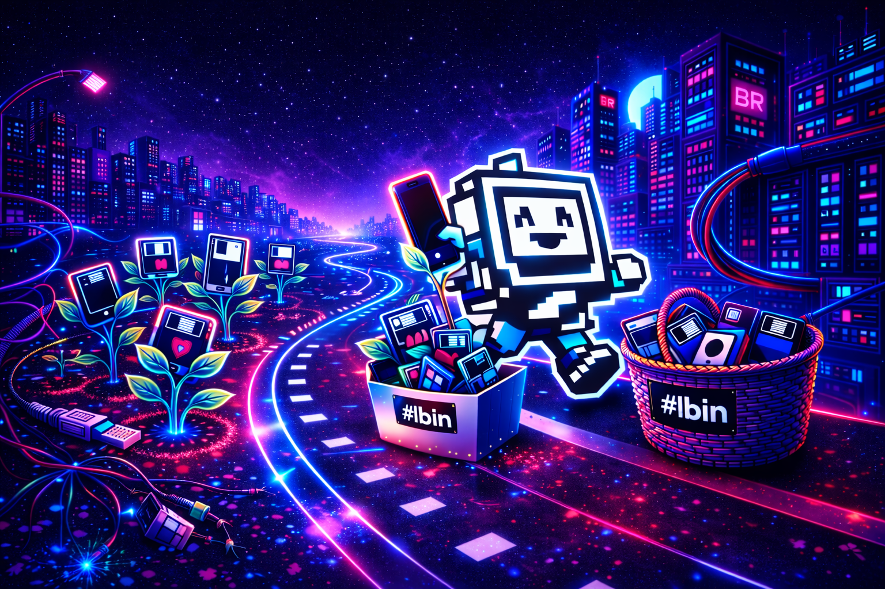
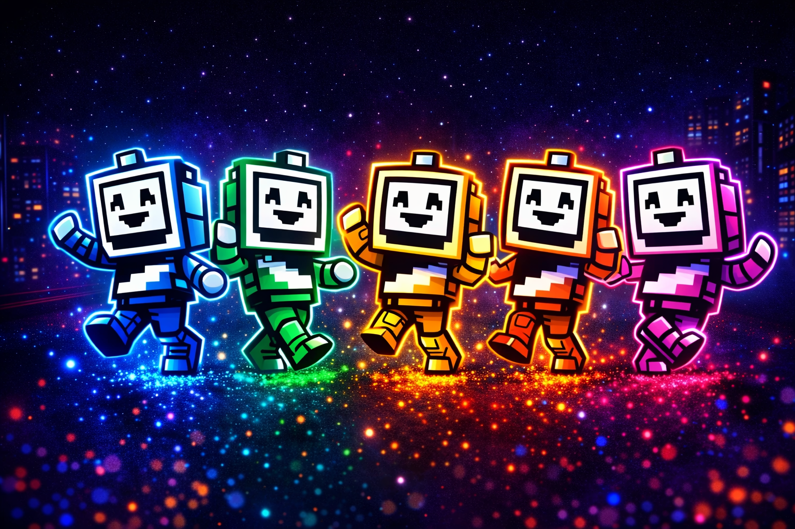
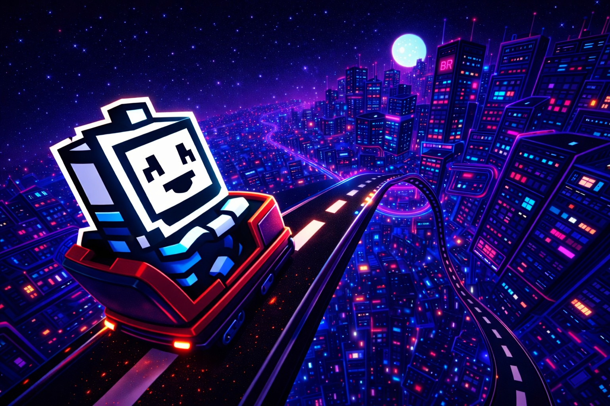

<p align="center">
  
</p>

# blackroad-operator

> CLI tooling, node bootstrap scripts, and operational control for BlackRoad OS.

[](https://github.com/BlackRoad-OS-Inc/blackroad-operator/actions/workflows/ci.yml)

## Overview

The `br` CLI dispatcher and all operational tooling. Routes `br <command>` to the right tool script. Also includes the MCP bridge server for remote AI agent access.

<p align="center">
  
</p>

## Structure

```
blackroad-operator/
├── br                # Main CLI entry point (zsh dispatcher)
├── src/              # TypeScript source
├── tools/            # 37 tool scripts (br <tool>)
├── cli-scripts/      # Standalone CLI utilities
├── mcp-bridge/       # MCP bridge server (localhost:8420)
│   ├── server.py     # FastAPI MCP server
│   └── start.sh      # Start script
├── scripts/          # Bootstrap & setup scripts
├── templates/        # Project templates
└── test/             # Tests
```

## Quick Start

```bash
# Make br executable
chmod +x br
./br help

# Or install globally
ln -s $(pwd)/br /usr/local/bin/br
br help
```

## Key Commands

```bash
br radar             # Context-aware suggestions
br git               # Smart git commits
br deploy            # Multi-cloud deploy
br agent             # Agent routing
br cece              # CECE identity
br help              # All 37 commands
```

## MCP Bridge

Local MCP server for remote AI agent access:

```bash
cd mcp-bridge && ./start.sh   # Starts on 127.0.0.1:8420
```

## Meet the Agents

<p align="center">
  
</p>

Five specialized AI agents power the platform — each with unique capabilities, personalities, and roles. Learn more in [AGENTS.md](AGENTS.md).

## Contributing

See [CONTRIBUTING.md](CONTRIBUTING.md)

---

<p align="center">
  
  <br />
  <em>The road you build by running on it.</em>
</p>

© BlackRoad OS, Inc. — All rights reserved. Proprietary.
